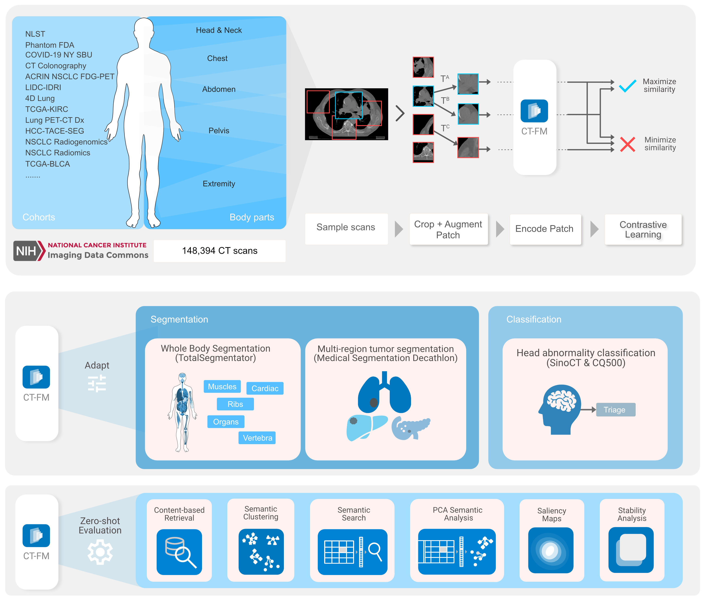

# CT-FM: A 3D Image-Based Foundation Model for Radiological Tasks

## Introduction
This repository contains the code and resources for CT-FM, a 3D image-based pre-trained foundation model designed for various radiological tasks. CT-FM is trained using self-supervised learning (SSL) on a large dataset of 148,000 CT scans. This model aims to address a range of tasks, including whole-body segmentation, tumor segmentation, head CT triage, and medical image retrieval. This work builds upon previous efforts in radiological AI, shifting from task-specific expert models to unified foundation models for broader adaptability and efficiency.

## Key Innovations

*   **Large-Scale 3D Pretraining:** Emphasis on 3D data rather than traditional 2D datasets.
*   **Task-Agnostic Training:** Enabling transferability across various radiological tasks.
*   **Open Source:** Model weights, data, and code are shared for collaborative development.

 
 

## Quick Links

-   __Downloading Data__

    ---

    All datasets used in the study are public

    [:octicons-arrow-right-24: Download data](./replication-guide/data.md)

-    __Use CT-FM models__

    ---
    CT-FM feature extractors and trained downstream 
    models are available on HF

    

    [:octicons-arrow-right-24: Go to HF](https://huggingface.co/project-lighter)

-   __Reproduce our pre-training framework__

    ---

    Implement our pre-training method on your own data

    [:octicons-arrow-right-24: Pretraining instructions](./replication-guide/pretraining.md)

-   __Build your projects using Lighter__

    ---

    Almost all CT-FM experiments use Lighter as the configuration system
    [:octicons-arrow-right-24: Explore here](https://github.com/project-lighter/lighter)

